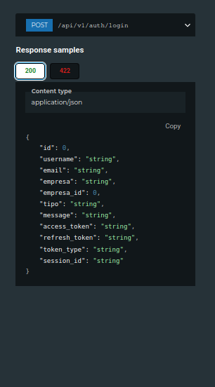
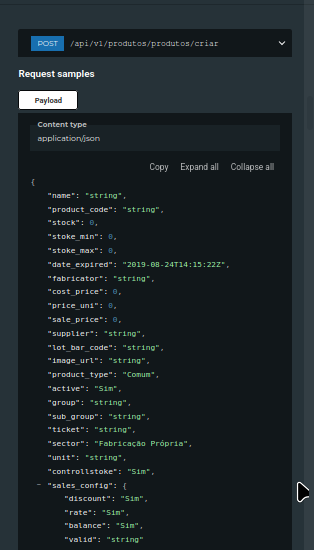
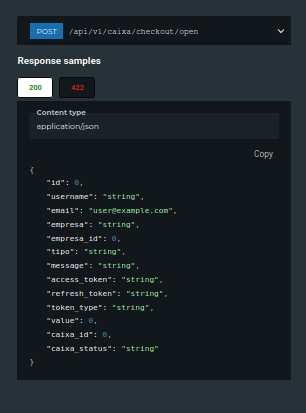

---

# 🚀 Qodo PDV – Sistema Completo de Ponto de Venda

<div align="center">


**Framework Python para acelerar a criação de sistemas de PDV com FastAPI**

[Documentação da API](#-documentação-da-api) • [Instalação](#-instalação-rápida) • [Exemplos](#-exemplos-práticos)

</div>

---

## 📸 Screenshots da API

### Login



### Cadastro de Produto



### Abertura de Caixa



---

## 📋 Índice

* [Por que este projeto existe](#-o-porquê-desta-biblioteca)
* [Funcionalidades](#-funcionalidades-principais)
* [Tecnologias](#️-tecnologias)
* [Instalação rápida](#-instalação-rápida)
* [Como rodar o servidor](#-como-rodar-o-servidor)
* [Documentação da API](#-documentação-da-api)
* [Configuração](#️-configuração)
* [Exemplos práticos](#-exemplos-práticos)
* [Estrutura do projeto](#️-estrutura-do-projeto)
* [Contribuindo](#-contribuindo)
* [Licença](#-licença)

---

## 📘 O Porquê Desta Biblioteca

Criar um PDV completo do zero é demorado e cheio de detalhes repetitivos: produtos, vendas, caixa, clientes, autenticação, permissões, métricas… tudo isso toma tempo.

O **Qodo PDV** foi criado para:

* acelerar o desenvolvimento de sistemas comerciais
* padronizar a estrutura
* reduzir bugs
* fornecer endpoints prontos
* facilitar a vida de quem vai integrar front-ends e apps móveis

A proposta é simples:
**Você foca em construir o seu sistema. A Qodo entrega a base pronta.**

---

## ✨ Funcionalidades Principais

### 🛒 Vendas e Caixa

* Gerenciamento completo de vendas
* Abertura e fechamento de caixa
* Cancelamentos
* Pagamentos via PIX e múltiplos métodos
* Cálculo automático de troco

### 📦 Produtos e Estoque

* CRUD completo
* Controle de inventário
* Categoria, código e imagem
* Alerts de estoque baixo

### 👥 Clientes e Funcionários

* Níveis de acesso
* Histórico de compras
* Sistema de crédito

### 📊 Relatórios e Dashboard

* Métricas em tempo real
* Indicadores financeiros
* API pronta para BI

---

## 🛠️ Tecnologias

* **FastAPI** – Framework rápido e moderno
* **Python 3.12+**
* **Tortoise ORM** – ORM assíncrono
* **SQLModel**
* **Pydantic v2**
* **MySQL / SQLite**
* **JWT + bcrypt** para autenticação

---

## ⚡ Instalação Rápida

### Clonando o projeto

```bash
git clone https://github.com/Gilderlan0101/qodo-pdv.git
cd qodo-pdv
pip install -e .
```

### Ou instalação via PyPI (quando publicado)

```bash
pip install qodo-pdv
```

---

## ▶️ Como rodar o servidor

### 1. Crie o arquivo `.env`:

```env
DB_HOST=localhost
DB_PORT=3306
DB_NAME=qodo_pdv
DB_USER=root
DB_PASS=senha
JWT_SECRET_KEY=sua_chave_secreta
ALGORITHM=HS256
DEBUG=True
```

### 2. Execute o servidor

```bash
python main.py
```

Ou, se instalado como pacote:

```bash
qodo-pdv
```

---

## 🌐 Documentação da API

Com o servidor rodando:

* **Swagger UI:**
  [http://localhost:8000/docs](http://localhost:8000/docs)

* **ReDoc:**
  [http://localhost:8000/redoc](http://localhost:8000/redoc)

* **Health Check:**
  [http://localhost:8000/health](http://localhost:8000/health)

---

## ⚙️ Configuração

### Usando SQLite (desenvolvimento)

```python
from qodo.conf.database import init_database

await init_database()
```

### Usando MySQL (produção)

```python
from qodo.conf.database import init_database, DatabaseConfig

config = DatabaseConfig.get_mysql_config()
await init_database(config)
```

---

## 🎯 Exemplos Práticos

### Criar uma empresa

```python
from qodo.controllers.user.create_account import *
from qodo.conf.database import init_database, close_database
import asyncio

async def create_my_company():
    await init_database()

    company = CreateCompany(
        full_name="Empresa X",
        email="email@example.com",
        password="senha_hash",
        company_name="Empresa X",
        trade_name="Nome Fantasia",
        cpf="00000000000",
        cnpj="00000000000000",
        state_registration="123456",
        municipal_registration="987654",
        crt="3",
        cep="00000000",
        street="Rua Exemplo",
        number="123",
        district="Centro",
        city="Cidade",
        state="EX"
    )

    result = await company.new_company()
    print(result)

    await close_database()

asyncio.run(create_my_company())
```

---

## 🏗️ Estrutura do Projeto

```
qodo-pdv/
├── src/qodo/
│   ├── auth/               # Autenticação / JWT
│   ├── controllers/        # Regras de negócio
│   ├── model/              # Models Tortoise ORM
│   ├── routes/             # Endpoints FastAPI
│   ├── schemas/            # Validação Pydantic
│   └── conf/               # Configurações gerais
├── main.py                 # Entrada do servidor
└── setup.py                # Build do pacote
```

---

## 🤝 Contribuindo

* Abra issues
* Sugira funcionalidades
* Envie PRs
* Mantenha o padrão do projeto

---

## 📄 Licença

Este projeto usa a licença **MIT**.
Leia o arquivo `LICENSE` para detalhes.

---

<div align="center">

### 🚀 Desenvolvido por **Gilderlan Silva**

Email: **[dacruzgg01@gmail.com](mailto:dacruzgg01@gmail.com)**
GitHub: **@Gilderlan0101**

⭐ Se este projeto te ajudou, deixe uma estrela!

</div>

---

